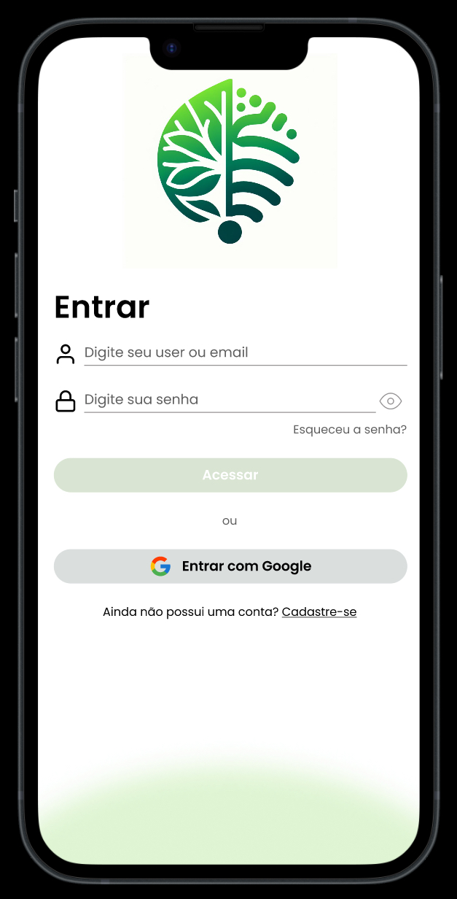

# Projeto EcoTech

Este projeto implementa funcionalidades para o aplicativo EcoTech usando JavaScript.

## Histórias de Usuário Selecionadas

As histórias de usuário selecionadas foram:

1. Como Cliente, quero acessar minha conta para visualizar e acessar a interface do aplicativo EcoTech.
2. Como cliente, quero cadastrar na a interface do aplicativo EcoTech para inserir minhas credenciais (usuário, email e senha).
3. Acesse o Backlog para saber mais sobre os critérios de aceitação - [backlog](https://fatecspgov.sharepoint.com/:x:/r/sites/Section_IES200.A400.M.048.146.20241/Student%20Work/Working%20files/SOFIA%20MATOS%20LESSA/Atividade%20Avaliativa%20Individual%2001%201/backlog_EcoTech.xlsx?d=w5f3c907ff4334d55a866a0b8b051d12a&csf=1&web=1&e=LkQfhv)

## Protótipo Figma

Você pode visualizar o protótipo do aplicativo EcoTech no Figma [aqui](https://www.figma.com/proto/tD1BA9bxFUhPLkpOqfeESF/EcoTech?type=design&node-id=1-4&t=x12Yi99iTEDgcr7X-0&scaling=scale-down&page-id=0%3A1&starting-point-node-id=1%3A4&classId=643468c0-d115-4faa-9b9b-cf46cd74bb12&assignmentId=15d79062-816c-4e56-84b6-73535347120c&submissionId=75ac2725-0b30-d32c-e39c-f466a4ab59e3).

## Telas do Aplicativo

Aqui estão as telas de login e cadastro para referência:

    

        <h3>Tela de Login</h3>
        
    

    

        <h3>Tela de Cadastro</h3>
        
    

## Rodando o Projeto

Para rodar o projeto, siga estes passos:

1. Abra o terminal.
2. Navegue até o diretório do projeto digitando `cd atv4`.
3. Instale as dependências digitando `npm install`.
4. Inicie o projeto digitando `npm start`.

Certifique-se de ter o Node.js e o npm instalados em sua máquina antes de executar os comandos acima.
